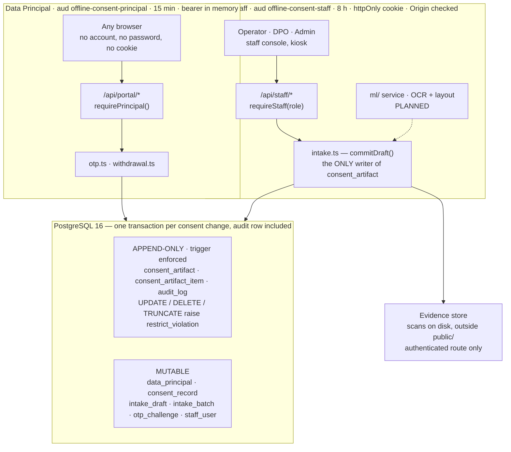
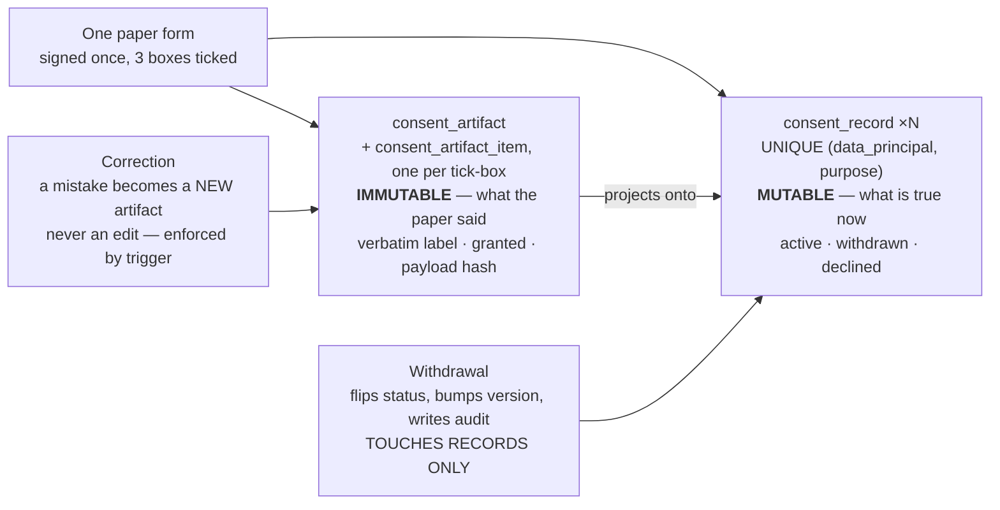
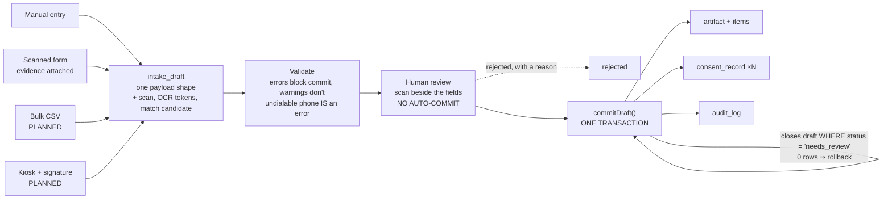
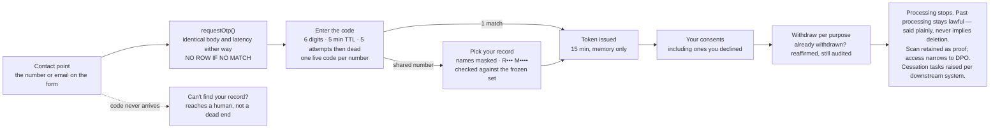

# Paper Consent Register — Product Requirements

**Rev. 1 · 5 September 2026 · DPDP Act 2023 (India)**

Consent collected on paper is invisible to the person who gave it. This system turns
signed forms into evidence that can be proved, and into a live record the person can
take back.

> The rendered version of this document, with the diagrams drawn to scale, is published
> as an artifact. This file is the version-controlled source alongside the code.

---

## 1. The problem

Organisations across India hold years of consent on paper: membership forms, enrolment
slips, event registrations. Someone signed in March 2019, ticked three boxes, and has
heard nothing since. They cannot see what they agreed to. They cannot change their mind.
Nobody can produce, on demand, the evidence that their consent was validly obtained.

The Digital Personal Data Protection Act 2023 makes both halves of that a live obligation:

- **s.6(4)** requires that withdrawing consent be *as easy as giving* it. A filing cabinet
  fails that test outright.
- **s.5(2)** requires that personal data held from before the Act commenced be covered by
  a notice, given as soon as reasonably practicable. Most pre-2023 paper carries no
  compliant notice, so every form digitised is also a notice that becomes due.

**The register has to satisfy two opposed demands at once: prove that consent was validly
given in 2019, and stop relying on it the moment someone says no in 2026.** That tension
is the shape of the product, and it is why the data model splits one paper form into an
immutable record of what the paper said and a mutable record of what is true now.

## 2. Goals and non-goals

### Goals

- Digitise a paper consent form in under two minutes, with the scan retained as evidence.
- Let a Data Principal find their record and withdraw per purpose, with no account and no
  password.
- Produce, for any person, an auditable answer to "what did they consent to, when, and on
  the strength of which document?"
- Surface the s.5(2) notice backlog that digitisation reveals, as a worked queue rather
  than a number.
- Make every consent state change provable after the fact, including the ones nobody
  acted on.

### Non-goals

- **Not a registered Consent Manager** under s.6(7)–(9) — that requires Board registration
  and a different trust model.
- **Not an erasure system.** Withdrawal is s.6(4); erasure is s.12(3). Conflating them is
  the most common product error in this space.
- **Not multi-tenant.** One Data Fiduciary, no `org_id`.
- **Not a downstream enforcement engine.** The register records what must stop; making it
  stop is a tracked human checklist.
- No collection of *new* consent on the web — the subject is paper that already exists.

## 3. Who uses it

| Actor | Needs | Access |
|---|---|---|
| **Data Principal** — the person who signed | See what they agreed to years ago; take it back without friction, an account, or a phone call. | Public portal. One-time code to a contact point printed on their form. 15-minute session held in memory. |
| **Operator** — back-office, high volume | Work through a box of forms quickly and correctly, with the scan beside the fields. | Intake, review queue, commit, kiosk. *Cannot* browse the register or the audit log. |
| **Data Protection Officer** | Answer a Board query; work the notice-owed and cessation queues; resolve duplicates and lookup requests. | Everything an operator has, plus register search, principal detail, audit trail, notices, exports. |
| **Administrator** | Manage staff accounts and roles. | Everything, plus user management. |

## 4. System architecture — two credential classes, one write path

One Next.js application serves both audiences, but they share nothing. A Data Principal
holds a short-lived bearer token with no role and no ambient cookie; staff hold a
role-bearing session cookie. The two are signed with the same secret and separated by
JWT audience, and each verifier independently asserts the shape it expects — a staff
guard demands a valid role, a portal guard demands the *absence* of one.

**Figure 1.** The boundary between the two subgraphs is the one that matters: a portal
token presented as a staff cookie, or a staff token presented as a portal bearer, is
refused by audience *and* by shape. Everything a person can prove in a Board proceeding
lives in the append-only panel, which the database itself refuses to let anyone edit.

## 5. Data model — one form, two kinds of row

When someone withdraws, the fact "granted" has to change — so processing stops — and
simultaneously not change — so the Fiduciary can still show that consent was validly
obtained on 4 March 2019. Those are two different rows.

**Figure 2.** Evidence and state are separate rows with separate lifetimes. The artifact
is written once and refused by the database thereafter; the record moves freely. A
correction arrives as a new artifact that supersedes the old one by date, and the
superseded artifact remains on file.

## 6. Flow A — intake: four ways in, one way through

Manual entry, a scanned form, a bulk spreadsheet and a tablet at the counter all produce
the same `intake_draft` with the same payload shape. They differ only in what fills it.
Nothing else writes an artifact — including the kiosk, whose confirmation screen *is* the
review screen. Four intake paths writing evidence four ways would drift, and the one that
drifted would be the one nobody tested.

**Figure 3.** The final `UPDATE` on the draft is the idempotency token for the whole
operation: a double-clicked commit matches zero rows, the transaction rolls back, and the
second artifact never exists.

**The rule that is easy to get wrong:** a form digitised today may have been signed years
ago. If the person withdrew since — or the form is undated, so it cannot be shown to
predate the withdrawal — the withdrawal stands. A newly digitised 2019 form must never
resurrect a consent withdrawn in 2026.

## 7. Flow B — withdrawal, as easy as giving

The person types the mobile number or email that appears on their form and receives a
six-digit code. No account, no password: s.6(4) makes friction here a compliance failure
rather than a security posture. Asking for identity documents at withdrawal would make
taking consent back harder than giving it.

The countervailing risk is that the portal becomes a way to ask whether a given phone
number is in the register. It answers identically — same body, same latency — whether or
not the destination matches anyone, and writes no row for one that does not.

**Figure 4.** A shared household number is the normal case in India, so possession of the
phone proves control of the endpoint, not identity — the disambiguation step shows masked
names drawn from a set frozen when the code was sent, never a roster. The dashed branch is
the escape hatch for a number transcribed wrongly, without which a typo silently and
permanently blocks a statutory right.

## 8. Functional requirements

| ID | Requirement | State |
|---|---|---|
| FR-1 | All intake modes produce an `intake_draft` with one payload shape; no other code path writes a consent artifact. | Built |
| FR-2 | A scan can be attached as evidence, with content type determined from the file's own bytes — never the browser's declared type. | Built |
| FR-3 | Validation separates blocking errors from advisory warnings. A phone that cannot be normalised to E.164 is a blocking error. | Built |
| FR-4 | Identity resolves on contact point plus normalised name. A close-but-different name on the same contact point halts commit and asks a person. Never merged automatically. | Built |
| FR-5 | Commit writes the artifact, items, consent records and audit entry in one transaction; idempotent under repeat submission. | Built |
| FR-6 | A committed artifact cannot be altered or removed. Corrections are new artifacts. | Built |
| FR-7 | Committing a form never reactivates a consent withdrawn after that form was signed. An undated form cannot predate a withdrawal. | Built |
| FR-8 | A Data Principal reaches their record with a one-time code to a contact point on their form. No account, no password. | Built |
| FR-9 | Where several people share a contact point, the portal offers a masked choice rather than assuming or disclosing. | Built |
| FR-10 | Withdrawal is per purpose and idempotent. Re-withdrawing changes nothing but is still recorded — a repeat may be evidence the first was not honoured downstream. | Built |
| FR-11 | Someone whose contact details were transcribed wrongly can reach a human without the portal disclosing whether they are in the register. | Built |
| FR-12 | Forms with no notice at collection accumulate a worked s.5(2) queue with delivery recorded per person. (Counted on the dashboard; queue outstanding.) | Partial |
| FR-13 | A withdrawal raises a cessation task per registered downstream system, with a stored due date and a legal-hold state for the statutory carve-out. | Planned |
| FR-14 | A DPO can search the register and see, for one person, every artifact, current consent, and the full audit trail. | Planned |
| FR-15 | A CSV of already-digitised records imports with column mapping and a per-row validation report; each row commits in its own transaction. | Planned |
| FR-16 | A tablet at the counter captures a drawn signature and reaches the same review-and-commit step, resetting after 90 s idle. | Planned |
| FR-17 | Scanned fields are extracted by a trained model, not an LLM: OCR tokens + layout classification for text, ink-density detection for tick-boxes. Every field remains human-confirmed. Labels derive from committed drafts, so the review screen doubles as the annotation tool. | Planned |

## 9. Security, privacy and non-functional requirements

| ID | Requirement | State |
|---|---|---|
| SEC-1 | Staff and Data Principal credentials separated by JWT audience; each guard independently asserts its expected shape. | Built |
| SEC-2 | A Data Principal's identity comes from the token subject and nowhere else. No portal route accepts an identifier in path, query or body — except code selection, checked against a server-stored set frozen at send time. | Built |
| SEC-3 | The portal is not an enumeration oracle: identical body, identical latency floor, no stored row for an unmatched destination. | Built |
| SEC-4 | One live code per destination; five attempts; five-minute expiry; per-destination and per-IP send limits counted from the challenge table. | Built |
| SEC-5 | Contact points stored only as a peppered hash. The challenge table must not become a phone directory if the database leaks. | Built |
| SEC-6 | Evidence served only via an authenticated route that logs each access, sandboxes the response, and narrows to DPO once a person has fully withdrawn. | Built |
| SEC-7 | Sessions revocable by cutoff timestamp rather than a deny list, both credential classes, checked every request. | Built |
| SEC-8 | Every mutating staff route verifies request origin, because the staff cookie is an ambient credential. | Built |
| SEC-9 | A scan is untrusted input. Recovered text is never interpolated into a query, path or command; the extraction model never chooses a database identifier. | Built |
| NFR-1 | Evidence retention stamped at upload and stored, so changing the setting cannot move the date of anything already held. | Built |
| NFR-2 | Paper dates stored and compared as calendar dates, never instants. A consent date that shifts by a timezone is a wrong compliance record. | Built |
| NFR-3 | Migrations forward-only and checksummed; an applied migration whose contents changed halts the runner. | Built |
| NFR-4 | Every form control labelled and keyboard reachable, errors announced rather than only coloured. | Built |

## 10. Where the Act lands in the system

| Provision | Obligation | Where it is discharged |
|---|---|---|
| s.5(1) | Itemised notice: what data, what purpose, how to complain | `consent_notice`, versioned per language, with the wording printed beside each tick-box |
| s.5(2) | Notice for pre-commencement data, as soon as practicable | Artifacts recording no notice at collection accumulate the notice-owed queue |
| s.5(3) | Notice in Eighth Schedule languages | `language` on each notice version |
| s.6(1) | Consent free, specific, informed, unambiguous, clear action | Per-purpose artifact items carrying the verbatim printed label |
| s.6(4) | Withdrawal as easy as giving | Public portal, one-time code, no account — the whole of Flow B |
| s.6(5) | Withdrawal does not affect prior lawful processing | Stated plainly on the confirmation screen; artifacts never altered |
| s.6(6) | Cease processing, and cause processors to cease | Cessation tasks per downstream system with stored due dates *(planned)* |
| s.8(7) | Erase on withdrawal unless retention required by law | Retention of the scan as proof of lawful collection — a recorded policy decision requiring DPO sign-off |
| s.12 | Access, correction, erasure | Access via the portal; correction and erasure are separate requests, deliberately not conflated with withdrawal |
| s.8(4) | Reasonable security safeguards | SEC-1 to SEC-9 |

## 11. Risks and decisions

**A mistyped phone number silently voids a statutory right.** If the transcribed number is
wrong, the code never arrives and s.6(4) fails for that person with nothing to show it —
the most dangerous failure precisely because it is invisible. *Mitigation:* undialable
numbers block commit rather than being stored; the raw transcription is kept for re-review;
the portal carries a prominent route to a human; public search by name is *not* offered
because it would be an enumeration oracle.

**A household member withdraws someone else's consent.** Shared numbers are ordinary; a
code proves control of the endpoint, not identity. *Accepted and documented,* because
demanding identity documents would make withdrawal harder than giving and breach s.6(4).
Compensating: every withdrawal is audited with IP and challenge, names are masked, and
re-granting requires a new artifact — new paper. A malicious household member can turn
processing off, never on.

**The extraction model has nothing to learn from.** Layout classification needs labelled
forms; at launch there are none. *Mitigation:* the review screen is the annotation tool —
every committed draft pairs OCR tokens with a human-verified payload. Tick-box reading
works from the first form (ink density needs no training); text extraction waits for
roughly fifty to a hundred real scans.

**Digitisation manufactures a compliance backlog.** Most pre-2023 paper carries no
compliant notice, so honest recording turns a dormant obligation into a countable, dated
one. *This is the intended outcome* — the dashboard leads with notices owed so the scale
is visible from the first week, not at the first Board query.

**Withdrawal is read as deletion.** People reasonably expect "withdraw" to mean "delete my
data". *Mitigation:* the confirmation screen states plainly that processing stops, past
processing is unaffected, and erasure is a separate request — with a route to make one.

## 12. Delivery status

The product does its whole job today: paper in, withdrawal out.

| Phase | Scope | State |
|---|---|---|
| 0–1 | Schema, migration runner, domain module, seed | Shipped |
| 2 | Staff authentication, roles, console shell | Shipped |
| 3 | Evidence storage, manual and scanned intake, review, commit | Shipped |
| 4 | Public withdrawal portal, one-time codes, notice pages | Shipped |
| 5 | Bulk CSV import with column mapping and per-row report | Blocked on 7 |
| 6 | Kiosk capture with drawn signature | Planned |
| 7 | DPO surfaces: register search, notice queue, cessation, merge | Next |
| 8 | Extraction service: OCR, tick-box detection, layout model | Planned |

**7 now precedes 5.** Bulk import pushes thousands of forms through an
exact-name matcher, with a duplicate gate built for one-at-a-time human review
(`commitDraft` throws `possible_duplicate` per draft) and no bulk merge on the
other side. Every duplicate it creates is a consent record the person cannot
withdraw and nobody can see, because register search and merge are two phases
later. Phase 7 gives those duplicates somewhere to go. See `TODOS.md` items 1-3.

### Open decisions — the organisation's to make, not engineering's

1. **Retention of scans after withdrawal.** Currently kept as proof of lawful collection
   under s.8(7); the DPO must sign that off.
2. **Which downstream systems** hold data a withdrawal must reach, and who owns each —
   this determines whether the s.6(6) checklist is honest.
3. **Spreadsheet formats.** CSV only today; native `.xlsx` is a deliberate omission that
   can be reversed.
