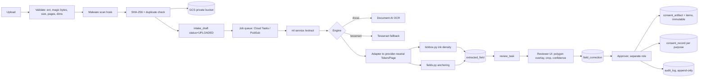

# Implementation Plan: Document AI extraction PoC

Branch: fix/eng-review-p0 · Status: PLAN — not started
Decisions: **D1-A** extend the existing schema, keep `migrate.mjs`, keep the ml service stateless ·
**D2-A** Enterprise Document OCR now, Custom Extractor config-gated, Form Parser off by default ·
**D3-C** Cloud Vision registered as a SECOND engine behind the same seam, so the
Document-AI-vs-Vision choice is settled by measurement on the pilot's forms rather than by argument

**Two differences between the cloud engines, found by writing both rather than reading about them:**
Vision returns *absolute pixel* vertices in the image we submitted, so its boxes are already in the
raster space `tickbox.py` measures ink in - nothing to convert, and no exposure to a vendor
deskewing the page into a corrected space we do not share. Document AI returns *normalized* vertices,
which is one conversion and one assumption more. Against that, Vision exposes **no model version to
pin**, so an accuracy number measured on it is not reproducible; Document AI can be pinned. (1)
favours Vision, (2) favours Document AI, and only the forms can say which matters more here.

## Verified before planning

- `google-cloud-documentai` major is **3.x** (3.8–3.15 documented). Shape:
  `DocumentProcessorServiceClient.process_document(ProcessRequest(name=..., raw_document=RawDocument(content=..., mime_type=...)))`.
  An async client exists (`DocumentProcessorServiceAsyncClient`) and suits the per-page concurrency
  decision. Pin `>=3.8,<4`; confirm every field name against the installed package at build time
  rather than from memory.
- Repo is **not empty**: 13 migrations, 16 tables, 23 API routes, immutability triggers on
  `consent_artifact`, `consent_artifact_item` and `audit_log`.

## Reuse map (spec entity → what exists)

| Spec | Repo | Note |
|---|---|---|
| DataPrincipal | `data_principal` | — |
| ConsentRecord | `consent_record` | — |
| ConsentPurpose | `purpose`, `consent_notice_purpose` | carries `printed_label` |
| ConsentEvidence | `consent_artifact`, `consent_artifact_item` | `no_update`/`no_delete`/`no_truncate` triggers |
| AuditEvent | `audit_log` | same three triggers |
| FormSubmission | `intake_draft` | `ocr_tokens`, `extraction`, `payload`; `intake_batch` for bulk |
| document storage refs | `evidence_object` | `storage_key`, `sha256`, magic-byte `content_type`, `byte_size` |
| consent retrieval / withdrawal | `/portal/consents`, `/portal/withdraw`, `/portal/otp/*` | no-account flow, built |
| human review + confidence gate | `draft-form.tsx`, `PREFILL_MIN_CONFIDENCE` | built |
| checkbox detection | `ml/app/tickbox.py` | ink density + printed-label anchor |
| key-value mapping | `ml/app/fields.py` | printed-label anchoring |
| provider-neutral OCR iface | `ml/app/engines/` `Engine` Protocol | built for exactly this |
| dataset export | `src/lib/training.ts`, `/staff/training/export` | weak-supervision pairs |

**New tables (11), via `scripts/migrate.mjs` (forward-only, checksummed):**
`form_definition`, `form_version`, `document_page`, `extraction_job`, `extracted_field`,
`field_correction`, `review_task`, `processor_configuration`, `dataset_document`,
`dataset_annotation`, `evaluation_run`, `extraction_metric`.

`extracted_field` is worth its own table rather than staying JSONB: it is what makes
"a human correction must not overwrite the original extracted value" enforceable, and what the
polygon-overlay review UI and the metrics break-downs query.

## Architecture

## Phases

**P0 — interfaces and mock (no cloud).** `DocumentStore` (local disk today, GCS driver behind it),
`JobQueue` (in-process today, Cloud Tasks/PubSub driver behind it), `MalwareScanner` (no-op default),
`DocumentAIEngine` behind the existing `Engine` Protocol + `DOCUMENT_AI_MOCK_MODE` with recorded
fixtures. *Verify:* `npm run lint && npm run typecheck && npm run build && npm test`, `uv run pytest`.

**P1 — schema.** 11 new migrations. UUID PKs, UTC timestamps, indexes on data-principal id,
submission status, review status, purpose id, timestamps, document hash. Idempotency constraint on
consent creation keyed by `(submission_id, purpose_id)`. *Verify:* migrate up on a clean DB, re-run
is a no-op, checksum guard trips on edit.

**P2 — ingest.** `POST /api/forms/upload` → validate (extension, magic bytes, size, page count,
image dims) → malware hook → SHA-256 → GCS → `intake_draft` UPLOADED → publish job. TIFF added to
`render.py`. *Verify:* invalid/oversized/duplicate/wrong-MIME uploads all rejected with distinct errors.

**P3 — Document AI engine.** New `ml/app/engines/documentai_engine.py`, registry entry, client built
at FastAPI startup, per-page concurrency with a cap, greyscale JPEG q85 upload, Tesseract fallback for
tick-boxes, `bbox` validator on `Token`. Adapter preserves processor id, processor version, timestamp,
entity confidence, normalized value, text anchor, page number, bounding polygon. *Verify:* fixture
tests green in mock mode; polygon→bbox conversion checked against a captured real response.

**P4 — review and approval.** `review_task` queue, polygon overlays, source crops, side-by-side
original vs corrected, reviewer comments, approve/reject/send-back, approval blocked until required
fields reviewed. Reviewer ≠ approver when configured. *Verify:* Playwright E2E over the full path.

**P5 — consent states.** GRANTED / DECLINED / NOT_SELECTED / AMBIGUOUS as a first-class enum.
Both-selected → AMBIGUOUS. Overlapping mark → AMBIGUOUS. Missing/unreadable purpose text → no
activation. Unknown form or notice version → review. **Every consent selection reviewed regardless of
confidence.** Signature = presence + polygon + reviewer confirmation only. *Verify:* unit tests per
state, plus the conflicting-selection and missing-purpose cases.

**P6 — dataset and evaluation.** `dataset_document` / `dataset_annotation` with train/val/**frozen
test** split, dataset versioning, per-prediction processor+version, precision/recall/F1/exact-match/CER,
checkbox and consent-state accuracy reported separately, break-downs by field type, handwritten vs
printed, scan quality, language, form version. Shadow evaluation before promotion; promotion requires
an explicit authorized approval step. No auto-training from corrections; no production documents into
training without explicit authorization. *Verify:* metrics reproduce on a fixed fixture set.

## Blocking dependency, carried from the eng review

`ml/app/fields.py:771-773` sets `tokens = []` when the band beside a label classifies as a comb —
**after** the engine runs. On a comb-cell form a better recogniser changes nothing. Check the pilot
template for comb cells before P3; if present, P3 gains per-cell cropping and the estimate moves.

Also unresolved from that review: `INK_THRESHOLD = 0.08` is documented as too low (a wrapped label
measured 0.100 and was recorded as consent). `npm run calibrate` exists. Do not demo consent state
before calibrating it.

## Config

`GOOGLE_CLOUD_PROJECT`, `GOOGLE_CLOUD_LOCATION`, `DOCUMENT_AI_OCR_PROCESSOR_ID`,
`DOCUMENT_AI_OCR_PROCESSOR_VERSION`, `DOCUMENT_AI_FORM_PROCESSOR_ID`,
`DOCUMENT_AI_FORM_PROCESSOR_VERSION`, `DOCUMENT_AI_CUSTOM_EXTRACTOR_ID`,
`DOCUMENT_AI_CUSTOM_EXTRACTOR_VERSION`, `DOCUMENT_UPLOAD_BUCKET`, `DOCUMENT_EVIDENCE_BUCKET`,
`GOOGLE_APPLICATION_CREDENTIALS` (local dev only), `DOCUMENT_AI_MOCK_MODE`, `MAX_UPLOAD_SIZE_MB`,
`OCR_JOB_TIMEOUT_SECONDS`. No processor id, region or model version hard-coded. ADC by default;
Workload Identity in production; no service-account JSON in source.

## Assumptions, limitations, cost drivers

- **Assumption:** the pilot form is ≤15 pages (Document AI online/sync ceiling) and Document AI OCR is
  available in the chosen region. Both are five-minute checks that gate the design; unverified.
- **Limitation:** no live Google Cloud verification is possible without an authorized project and
  processor ids. Everything ships tested in mock mode, with live-verification steps listed explicitly.
- **Limitation:** signature handling is presence-in-region only. No biometric matching, no identity
  authentication, and presence never substitutes for purpose-level consent.
- **Cost drivers:** per-page OCR (~$1.50/1k pages at the raw-OCR tier), GCS storage and egress, and
  page count per form. Form Parser / Custom Extractor sit at roughly 20x per page and are off by
  default for that reason.
- **Not hard-coded:** jurisdictional policy. Retention, legal hold and residency stay configurable.
